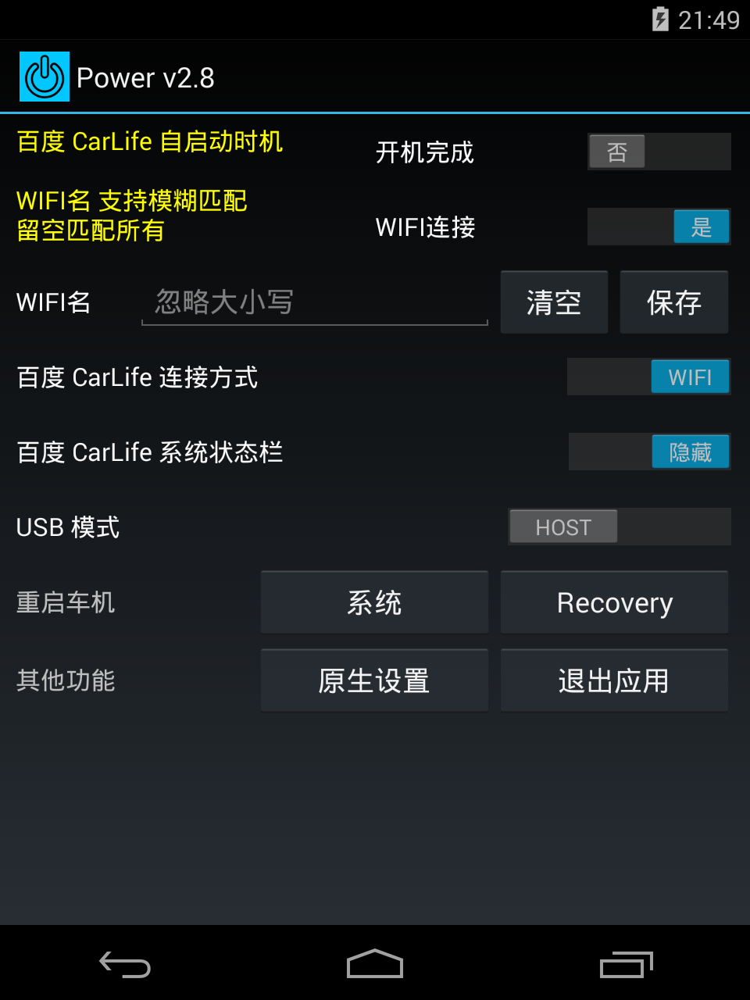

# Beijing Hyundai Custo

北京现代库斯途车机相关 APK 软件。

## 适用车型
北京现代 库斯途车机

## 安装教程
从 [Releases](https://github.com/FanchangWang/custo_power/releases/latest) 下载已公签的 APK。
通过侧边栏破解安装，[侧边栏破解教程(ix35跟库斯途通用)](https://www.dongchedi.com/ugc/article/7230446621241344524)

## 功能列表
- 百度 CarLife 自启动：开机自启动、连接 WIFI 后自启动(支持模糊匹配)
- 百度 CarLife 连接方式：切换 USB/WIFI 模式
- USB 模式：切换 HOST/DEVICE 模式
- 重启车机：系统重启、Recovery 模式重启
- 其他功能：打开原生设置、退出应用

## 其他原装应用修改版
- 百度 CarLife
  + 竖屏全屏显示
  + 自动重试连接

## 预览图

